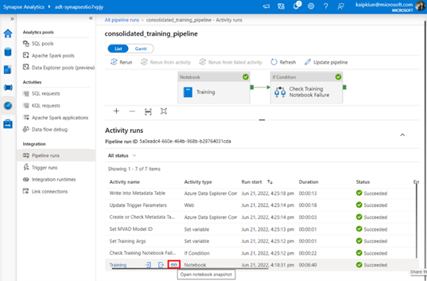

# About

This folder contains the ADT-MVAD toolkit, i.e.  a set of pipeline artifacts and a powershell script that will help provision necessary resources and link them together to Synapse workspace.

## Toolkit Structure
The toolkit contains the following:
- `linkedService/*`: Templates of linkedServices to your Synapse workspace. Values will be automatically populated by the setup script.
- `notebook/*`: Notebooks with Python code for
    - Preprocessing the raw data and format data to be taken in readily by MVAD, and optionally smoothen training data
    - Calling MVAD apis to run training or inference
    - Visualizing plots to interpret raw anomaly results
- `pipeline/*`: Synapse training/inference pipeline templates. These configurations are provided for the Synapse workflow: the training and inference pipelines to define scenarios through user-input, help orchestrate and pass meta-data between training and inference, and surface any errors.
- `setup.ps1`: Powershell script to provision resources, link resources to Synapse workspace, and grant necessary permissions.

 

## Dependencies
This toolkit currently implements MVAD version 1.1, as set in the SynapseML version: `com.microsoft.azure:synapseml_2.12:0.9.5-19-82d6b563-SNAPSHOT`, that runs in the Synapse pools.

 

# Setup: Provision Resources

Before setting up, see the prerequisites in the [main page](../README.md/#prerequisites).
To run `setup.ps1`, provide these parameters:

#### General setup parameters

* `SubscriptionId` [required]: The subscription where all the newly provisioned resources reside in.
* `ResourceGroup` [required]: The script will create new resource group.
* `Location` [required]: Region of the resource group.

#### ADX-related setup parameters

* `ADXSubscriptionID` [optional]: The subscription ID of your Data Hisotry ADX cluster. Default to the same subscription for all your resources (SubscriptionId in General section above).
* `ADXResourceGroup` [required]: ADX cluster resource group.
* `ADXEndpoint` [required]: ADX URI (obtained from ADX instance in Azure portal).
* `ADXClusterName` [required]: ADX cluster name.
* `ADXDatabaseName` [required]: ADX cluster database name.
* `ADXTable` [required]: ADX cluster table name used for ADT data history.

#### ADT-related setup parameters

* `ADTSubscriptionId` [optional]: The subscription ID of your ADT Instance. Default to the same subscription for all your resources (SubscriptionId in General section above).
* `ADTResourceGroup` [required]: ADT resource group.
* `ADTEndpoint` [required]: ADT host name (obtained from ADT instance in Azure portal).

#### Synapse-Sql-User setup parameters

* `SqlUser` [required]: Synapse workspace Sql user.
* `SqlPassword` [required]: Synapse workspace Sql password. The password must be atleast 8 characters long and contain characters from three of the following four categories: (uppercase letters, lowercase letters, digits (0-9), Non-alphanumeric characters such as: !, $, #, or %).

#### Default Resource Names [Optional]

* `SynapseWorkspaceName`: Synapse workspace name, defaults to `adt-synapse`.
* `KeyVaultName`: Key Vault name, defaults to `synapse-keyvault`.
* `MVADResourceName`: MVAD name, defaults to `adt-mvad`.
* `ADLSAccountName`: ADLS name, defaults to `synapseadls`.
* `ADLSContainer`: ADLS container name, defaults to `user`.

#### Default Resource Configuration [Optional]

* `SparkPoolNodeSize`: Synapse spark pool Node Size, defaults to `Small` (4 vCores / 32 GB memory).
* `AutoScaleMinNodeCount`: Minimum Synapse spark pool Node Count, defaults to `4`.
* `AutoScaleMaxNodeCount`: Maximum Synapse spark pool Node Count, defaults to `10`.
* `AutoPauseDelayInMinute`: Synapse spark pool autopausing policy, defaults to `5`.
* `NotebookNodeCount`: Synapse notebook Spark pool worker node allocation, defaults to `1`.

 

## Run setup script

A sample command will look like this:

`.\MVADToolkit\setup.ps1 -SubscriptionId <subscriptionId> -ResourceGroup <rg> -Location <location> -ADXResourceGroup <adx_rg> -ADXEndpoint <adx_endpoint> -ADXClusterName <cluster> -ADXDatabaseName <database> -ADXTable <table> -ADTResourceGroup <adt_rg> -ADTEndpoint <adt_endpoint> -SqlUser <user> -SqlPassword <password> `

- This will run for 5-10 mins.
- If there are permission errors, use the following command:` Set-ExecutionPolicy -Scope Process -ExecutionPolicy Bypass`
- While the script runs, you can log to your Azure account and check the logs for progress. Once the script has finished running, a url to your **Synapse workspace** will be returned.

 

# User-guide 

The setup script provisions all necessary resources, including the Synapse workspace that we leverage for the toolkit. We perform the following steps through the Synapse UI:
1. Scenario definition: Define one scenario by filling in the required user-defined parameters in the parameter pop-up window
2. Training pipeline run: Trigger the training pipeline run for the defined scenario
3. Inference pipeline run: Trigger the inference pipeline run, using the generated inference trigger which shows up once training successfully completes. 
4. Repeat steps 1-3 as needed for your different scenarios
5. Monitor pipeline runs: Use the monitoring UI to ensure the runs complete without errors
6. Access & visualize results: Access the anomaly detection results in associated scenario's ADX table, and use the provided visualization notebook to get plots of the time-series and anomalies. 

The following data-flow diagram illustrates how the toolkit's provided pipeline configurations allows data to flow, from the user-input parameters to the training pipeline, to the inference pipeline, and finally as the anomaly detection results.

  

  

## Scenario definition & training pipeline run
In the Synapse Workspace UI,
- navigate to the Pipelines tab, and click on the `consolidated_training_pipeline`.
- Click on the "Add trigger" button and click on the "Trigger now" button
    
    

- A pop up will appear, with a list of necessary scenario parameters to fill in:
  - #TODO add details

    

- Click on 'OK' to trigger the training pipeline.

Once the training pipeline is triggered, the pipeline run can be **monitored** using the "Pipeline runs" tab in the "Monitor" tab. The training pipeline run will appear, and you can drill down on the run by clicking on the name. It will open this page:

   

Note:
- The activities in the training pipeline runs are planned according to the configurations provided in the toolkit's pipeline json file.
- As part of the activities, the training notebook takes in the user-defined input parameters.
- The notebook can be opened using the button highlighted above, and can be used for **debugging** in case of pipeline failure.

  

### #TODO [Optional] smoothing training data

  

## Inference pipeline run

Once the training pipeline is finished executing, an associated inference pipeline trigger is automatically generated, configured to run on a scheduled basis (1 run per 10 minutes to give anomaly detection result at near real-time). According to the toolkit's pipeline configuration:
- The automatically generated inference trigger is named: `scenario_name+ ”10min”`, and has a 10-minute recurrence inference cadence. This can be modified manually by the user, see [this section](./troubleshooting.md/#starting-stopping--creating-new-inference-pipeline-runs) in the troubleshooting guide.
-	The inference data’s time-window is dynamically calculated by the inference pipeline setup, through the equation below:
    >`Inf_window_start = T-(sliding_window * resampling_rate + inf_cadence_10min + buffer_5min)`
     
    
    - The inference time-window is calculated from the user-input parameters of `sliding_window` (in terms of data-points) and `resampling_rate` such that the total inference time-window includes at least the **sliding window time**, and a **10min time period** for which the inference results will be extracted. 
    - A 5-minute buffer time is used to make sure data gets populated in ADX through data-history, particularly if it has batch lag.
- For each scenario, the necessary parameter values are carried on from the training phase to the inference phase. This includes: 
    - The Cognitive Services’ trained MVAD model id, which is critical to keep track of the scenario’s trained model that the inference pipeline calls upon
    - A list of essential pre-processing parameter values used at training that need to be persisted and used at inference, including:
    -	Resampling rate and associated aggregation functions for numerical and categorical variables (i.e. twin properties)
    - Normalization (min and max values) and value lists for respectively numerical and categorical variables (i.e. twin properties), as seen in training data
    - Note that most of these pre-processing parameters are currently default arguments in the pre-processing functions used in the training and inference notebooks, but can be tweaked by editing the notebooks.

To run the inference pipeline for a particular scenario, go to the associated trigger:
- navigate to the "Manage" tab, and click the "Trigger" tab.
- Select the wanted trigger from the list (recall scenario name is the first part of the trigger name) 
- Specify the start datetime, and optionally specify an end datetime.
- Select the status to be "started", click OK.

  

  

## Scenario & pipeline run monitoring
The past and present training and inference pipeline runs can be **monitored** through the Monitor UI in the “Pipeline runs” tab. Note that the pipeline names are “consolidated_inference_pipeline” and “consolidated_training_pipeline” as named in the artifact by default for any scenario.

### Verifying Scenario Parameters
- Currently, the associated scenario for each pipeline run can be identified by the parameters in the “Parameter” column, including **scenario name**. The parameters’ list contains all the parameters that are input for a particular scenario’s training or inference run.
- Additionally, scenario names for inference runs can currently be identified according to their dynamically-named automatic trigger: named according to `scenario_name+”10min”`. 

### Metadata table
Scenarios, for which training has succeeded, are also logged into the `metadataTable` ADX table in the ADX cluster database associated with this feature. It contains the necessary parameters for each trained scenario, including:
- Input parameters that define the scenario: training start-time, training end-time, sliding window, input ADT query, selected metrics or properties, resampling rate
- Training output parameters, used as input for the scenario’s associated inference pipeline: 
  - `mvadModelId`: this is the Cognitive Services’ trained MVAD model id, critical to keep track of the scenario’s trained model that the inference pipeline calls upon
  - `AdditionalNote`: a list of essential pre-processing parameter values used at training that needs to be persisted and used at inference, as described in section 4.2. 

 

### Pipeline runs’ status and error logs
In the Monitor UI for pipeline runs, users can check their progress using the Status column for filter with options: “succeeded”, “in progress”, “queued”, “failed”, “cancelled”. For runs that have failed, users can:
- Check the error message in the Error column, e.g.:
  
- Drill down further where the error occurred in the notebook: Click on failed pipeline run to show the list of associated activity runs --> Open notebook snapshot --> Look for notebook cell generating the error.
  

## #TODO Accessing & visualizing anomaly results (optional)

  

