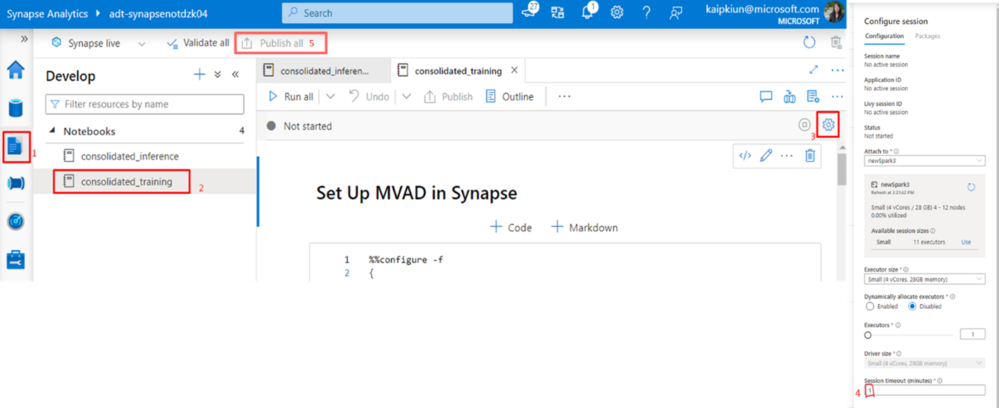

# Azure resources' setup

## Sharing Synapse Workspace

To share access to a given Synapse Workspace to:

- Data plane access: In Synapse Workspaces Manage tab --> Access control tab --> Add user and wanted role.
- Control plane access: In Portal, on Synapse Workspace --> Access Control (IAM) --> Add user and wanted role (owner or contributor). This allows user to additionally  create Synapse resources such as Spark pools.

See [Azure documentation](https://docs.microsoft.com/en-us/azure/synapse-analytics/security/synapse-workspace-access-control-overview) for more information.

<br>

## Resource limitation checks

### Concurrent read and write capacity of ADX cluster

Before we do any pipeline runs, we would want to check the concurrent read and write capacity in our ADX cluster. If we want to run anomaly detection on a large number of scenarios, we need to ensure that our ADX cluster is equipped for the large number of reads and writes. Please see the following sub-section on how to set the ADX cluster configuration accordingly.
<br>

### Determining and changing ADX read and write capacity
First, see current limits using this KQL command: `.show capacity`
  -   The operations of interest are the **DataExport** and **Queries**. Ideally, we would want these numbers to be *greater than the number of scenarios* we are planning to have run concurrently. 

If we want to adjust these limits, we will need to follow the next steps:
  1. Obtain the # of nodes and # cores per node from Azure portal 
  2. Obtain cluster policy capacity using this KQL command: `.show cluster policy capacity` 
  3. Do	calculations to adjust DataExport capacity & Queries limit (see [documentation](https://docs.microsoft.com/en-us/azure/data-explorer/kusto/management/capacitypolicy)) 
    <br> a. Obtain `ClusterMaximumConcurrentOperations` and `CoreUtilizationCoefficient` needed for a target concurrent **DataExport** capacity 
    <br> b. **DataExport** capacity, the cluster’s total export capacity, is calculated with this equation:  
     > `Minimum(ClusterMaximumConcurrentOperations, Number of nodes in cluster * Maximum(1, Core count per node * CoreUtilizationCoefficient))` , where:

      -  Number of nodes in cluster: obtained from Azure portal as described above 
      - Core count per node: obtained from Azure portal as described above 
      - `ClusterMaximumConcurrentOperations`: see the Policy -> ExportCapacity -> - `ClusterMaximumConcurrentOperations` (obtained by using `.show cluster policy capacity` command) 
      - `CoreUtilizationCoefficient`: see the Policy -> ExportCapacity -> `CoreUtilizationCoefficient` (obtained by using `.show cluster policy capacity` command) 

      c. Calculate **Queries** limit: Queries limit is according to equation: `# of cores per node * 10`  (See [documentation](https://docs.microsoft.com/en-us/azure/data-explorer/kusto/concepts/querylimits#limit-on-request-concurrency))

  4. Update limits using this KQL command: `.alter-merge capacity policy` (See [documentation](https://docs.microsoft.com/en-us/azure/data-explorer/kusto/management/alter-merge-capacity-policy-command)) 
      <br> a. Example command to Export Capacity `CoreUtilizationCoefficient`:

              ```
              .alter-merge cluster policy capacity ``` 
              { 
                "ExportCapacity": { 
                  "CoreUtilizationCoefficient": 1 
                } 
              }```
              ```
      <br> b. Replace the number 1 with your desired option (double), but 1 is the highest coefficient
      <br> c. Confirm that the change has taken effect by using this KQL command: `.show capacity` 


<br>


### Spark pool nodes

Running multiple Anomaly Detection scenarios concurrently will require running multiple Synapse pipelines (with a Synapse notebook step) concurrently, particularly for near-real time inference at regular cadence. Consequently, the Synapse Spark
pool resources should be configured to handle the estimated number of scenarios.

We have set the default values for these configuration parameters
in the PowerShell script as follows:

- SparkPoolNodeSize = "Small"
  - This is the smallest and cheapest Spark pool configuration
  - 4 vCores / 32 GB memory
  - Thisconfiguration should be sufficient in most cases
- AutoScaleMinNodeCount = 4
  - By default, we have enabled Spark pool auto scale so that we only scale up as needed.
  - This is the lower bound of the nodes count. 
- AutoScaleMaxNodeCount = 10
  - This is the upper bound of the nodes count, provides the buffer to allow autoscale to expand capacity only when needed to avoid pipeline failure.
- AutoPauseDelayInMinute = 5
  - Autopausing for the Spark pool is enabled by default to ensure that we are spending compute resource only when an active pipeline is running
- NotebookNodeCount = 1
  - This is the number of nodes assigned to a notebook (which is part of the pipeline run)

In the configuration described above, we can only safely run 5 (AutoScaleMaxNodeCount/2) scenarios since each pipeline / scenario needs 1
driver node + 1 notebook node. If we go beyond 5 pipelines / scenarios, we will
experience a lot of throttling, delays and failed pipeline runs.

According to your estimated number of scenarios, you can specify
your own Spark pool configuration by providing the parameters to the PS setup command, e.g.:

* `-SparkPoolNodeSize "Small" -NotebookNodeCount 1 -AutoScaleMinNodeCount 4 -AutoScaleMaxNodeCount 10 -AutoPauseDelayInMinute 5`

<br> 

### Synapse notebook idle time

Before running any pipelines, to ensure that the Synapse pool is released once the notebook finishes running within an executing pipeline, the notebook session timeout needs to be set low through the Synapse Analytics UI: 1. In Develop tab --> 2. select the training or inference notebook --> 3. go to settings --> 4.  reduce the default session timeout to 1 minute --> 5. Click on 'Publish all' to save changes.



N.B: Currently, there is no way to do so programmatically through PowerShell command.

<br>

## #TODO Stopping & creating new inference pipeline runs

####################TODO###################
<br>

## Error surfacing from training and pipeline runs
The training and inference pipelines check the outputs (exitValue) from their respective notebook run and. Depending on the value, the pipeline is channeled to "succeed" or "failure" set of activities, with error messages if any, surface in the “Error column” of the monitoring tab, and the “Activity run” section for specific pipeline runs. 

Check name | If notebook output contains | Consequence or error msg 
--- | --- | ---
“Check Training Notebook Failure” <br> Solution: check inference notebook for cell with error| At returned value start: `Failure` | If true, error msg output to UI. If false, following activities happen: <br> • 		MVAD model id set as variable <br> • Inference trigger created with parameters passed from training <br> • Trigger started <br> • Metadata Table created in ADX <br> • Parameters passed from training written in Metadata table
"Check HaltInference Triggers" <br> Solution: check inference notebook for cell with error| At returned value end: `[HaltSubsequent InferenceRuns]` | If true: <br> • Inference trigger stopped (web activity) <br> • Error msg output to UI: `No valid MVAD model found for inference, stopping future triggers for this scenario inference run`
"Check Inference Notebook Failure" <br> Solution: check inference notebook for cell with error| At returned value start: `Failure` | If true, error msg: as per notebook, and (if any) raw error, including the following: <br> • `Model does not exist [HaltSubsequentInferenceRuns]` <br> • `Model_status ==Failed` <br> • `Unable to query data from ADX. Full error log: " + str(e)` <br> •`No Data Queried from ADX` <br> • `No training data preprocessing configurations` <br> • `Data processing failure. Full error log: " + str(e)` <br> • `No Data After Data Processing` <br> • `Unable to create DetectMultivariateAnomaly object. Full error log: " + str(e)` <br> • `Inference Failure. Full error log: " + str(e)` <br> • `Unable to Write Inference Result to ADX. Full error log: " + str(e)`


