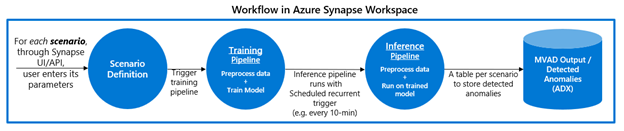

# Azure Digital Twins Multivariate Anomaly Detection Toolkit

Azure Digital Twins Multivariate Anomaly Detection Toolkit is a sample project to showcase a low-code integration of [Azure Digital Twins](https://docs.microsoft.com/en-us/azure/digital-twins/overview) with [Azure AI and Cognitive Services' Anomaly Detector](https://azure.microsoft.com/en-us/services/cognitive-services/anomaly-detector/), an advanced AI solution to help identify abnormal operations or defective assets in near real-time.

This integration toolkit leverages [Azure Data Explorer (ADX)](https://docs.microsoft.com/en-us/azure/data-explorer/data-explorer-overview) for data egress, and [Synapse Analytics](https://docs.microsoft.com/en-us/azure/synapse-analytics/overview-what-is) as the UI platform to host and run the toolkit code. ADT users can thus easily onboard and quickly connect to a downstream AI/ML solution. The goal of this toolkit is to allow ADT users to easily leverage the power of the twin graph, with historized time-series data, to identify anomalies in modelled environments. To do so, the toolkit provides a workflow for training multiple Multivariate Anomaly Detector models for several scenario analyses, based on historical digital twin data. It then leverages the trained models to detect multivariate anomalies in modeled Azure Digital Twins environments, in near real-time. This is done by:
- Defining one or more scenarios:
  - [Querying the twin graph](https://docs.microsoft.com/en-us/azure/digital-twins/how-to-query-graph) to provide a scenario's wanted **context** by leveraging ADT's ADX plugin,
  - Selecting the target properties in the scenario, i.e. the multiple variables, to later **analyze all together in a multivariate** fashion,
  - Ensuring data from the selected twin graph **time-series** variables' data is **historized** to an ADX cluster: directly through [ADT's Data History feature](https://docs.microsoft.com/en-us/azure/digital-twins/how-to-use-data-history?tabs=cli) or indirectly by linking an associated ADX table,
- For each scenario, running the **training** pipeline so that data is preprocessed and MVAD's AI model learns the scenario's system's **normal behavior** from the historized data. 
- Running the **inference** pipeline so that data is preprocessed and the scenario's associated trained AI model can detect **anomalous behavior** in near real-time.
- Accessing and visualizing the anomaly detection results in an ADX table.

 

## Features
This project provides the following features:

* ADT-MVAD toolkit (See [the toolkit guide](./MVADToolkit/README.md/#about) (./MVADToolkit/README.md/#about) for more info):
  - Automatic onboarding: automatic provisioning and linking of the necessary Azure resources done through a Powershell script (`./MVADToolkit/setup.ps`). 
  - Synapse artifacts 
    - Configurations are provided for Synapse workflow: the training and inference pipelines to define scenarios through user-input, help orchestrate and pass meta-data between training and inference, and surface any errors.
    - Code in Synapse notebooks that:
      - Preprocess the raw data and format data to be taken in readily by MVAD, and optionally smoothen training data
      - Call MVAD apis to run training or inference
      - Visualization plots to interpret raw anomaly results
    - The configuration and code can easily modified and extended by user to suit their needs

* Sample dataset (See the [`Synthetic Data Generation` folder](./Synthetic%20Data%20Generation/README.md/#Intro) for more info):
  - To help you test-drive this toolkit easily, we provide code to prop up sample ADT twins, and synthetically generate sample time-series data.
  - We provide code to pump the sample time-series data as twins' property updates. Alternatively, the time-series can be uploaded to the linked ADX table.

 

## How to use this sample

### Prerequisites
* Azure subscription to [create the resource group and the required Azure resources within](https://docs.microsoft.com/en-us/azure/developer/intro/azure-developer-create-resources) for this toolkit
* To analyze your assets with MVAD, ensure you have an Azure Digital Twins instance that encompasses the target system, ie. cluster of assets ([see the ADT docs for how-to](https://docs.microsoft.com/en-us/azure/digital-twins/overview)) . If you do not have one, set up a sample one according to the [`Synthetic Data Generation` folder](./Synthetic%20Data%20Generation/README.md/#Intro).
* Ensure you have Owner and Azure Digital Twins Data Reader role in your Azure Digital Twins instance through Azure Portal
* Ensure you have Owner role in the associated ADX through Azure Portal to be able to read the historized time-series data, and write the toolkit's metadata table and results table
* To run the setup script, install the following modules in Powershell, if you don't already have it installed:
  * Azure Powershell: [Documentation](https://docs.microsoft.com/en-us/powershell/azure/install-az-ps?view=azps-7.3.2)
  * Azure Synapse Powershell module: [Documentation](https://docs.microsoft.com/en-us/azure/synapse-analytics/quickstart-create-workspace-powershell#install-the-azure-synapse-powershell-module)

### Installation

- Clone this repo
- Auto-provision the required Azure resources (See [./MVADToolkit/README.md](./MVADToolkit/README.md/#about) for more info):

  - Determine the resources parameters for the Powershell setup script and run the script.
  - Run the PowerShell setup script to auto-provision the resources. This will take 5-10 mins.

    
- If you are bringing in your own ADT instance, ensure there is an appropriate time-series data source for your MVAD analysis in the ADX table. If you do not have one, set up a sample one according to the [`Synthetic Data Generation` folder](./Synthetic%20Data%20Generation/README.md/#Intro).

 

### Quickstart
The setup script provisions all necessary resources, including the Synapse workspace that we leverage for the toolkit. We perform the following steps through the Synapse UI:
1. Scenario definition: Define one scenario by filling in the required user-defined parameters in the parameter pop-up window
2. Training pipeline run: Trigger the training pipeline run for the defined scenario
3. Inference pipeline run: Trigger the inference pipeline run, using the generated inference trigger which shows up once training successfully completes. 
4. Repeat steps 1-3 as needed for your different scenarios
5. Monitor pipeline runs: Use the monitoring UI to ensure the runs complete without errors
6. Access & visualize results: Access the anomaly detection results in associated scenario's ADX table, and use the provided visualization notebook to get plots of the time-series and anomalies. 

See the [toolkit's user-guide](./MVADToolkit/README.md/#user-guide), for the detailed steps on how to run a scenario end-to-end.

 

## Resources

- [ADT resources](https://docs.microsoft.com/en-us/azure/digital-twins/overview) 
  - [ADT query](https://docs.microsoft.com/en-us/azure/digital-twins/how-to-query-graph)
  - [ADT ADX plugin](https://docs.microsoft.com/en-us/azure/digital-twins/concepts-data-explorer-plugin)
  - [ADT Data History](https://docs.microsoft.com/en-us/azure/digital-twins/how-to-use-data-history?tabs=cli)
- Cognitive services' Anomaly Detector resources (https://docs.microsoft.com/en-us/azure/cognitive-services/anomaly-detector/overview-multivariate) 

 

## Contributors
Contributors also include gantonius.